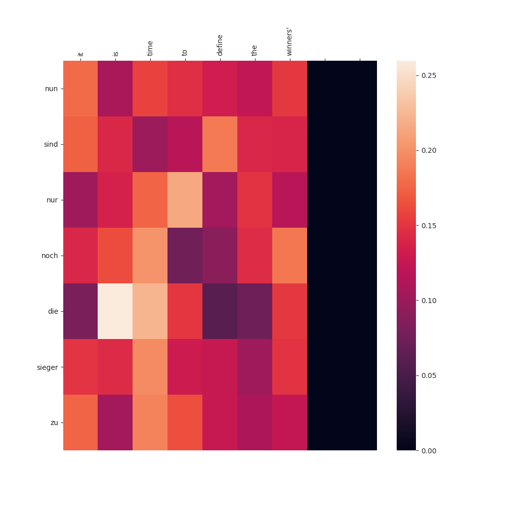

# Transformer

Simple Implementation of Transformer which appeared in '[Attention is all you need](https://arxiv.org/abs/1706.03762)'. 
To test the model
1. clone this repository
2. download required packages
3. run 'download.sh' scipt file to download datasets
4. run 'python transformer.py test'

### Sample Result Screenshot
* Dataset: [Stanford's Neural Machine Translation Project](https://nlp.stanford.edu/projects/nmt/). English to Deutsch(Germany)

* Used only 50000 sentence pairs for training. Used 1 Geforce RTX 2080 Ti.   More detail(hyperparameter) - Please check logs directory

* Sample Translation sentence

(I) = Input sentence   
(T) = Traget sentence   
(P) = Predict sentence  

* Sample Attention graph

*Implementation that helped me*  
*[graykode's implementation](https://github.com/graykode/nlp-tutorial)*  
*[GLACNet github('build_vocab')](https://github.com/tkim-snu/GLACNet)*
