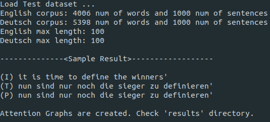
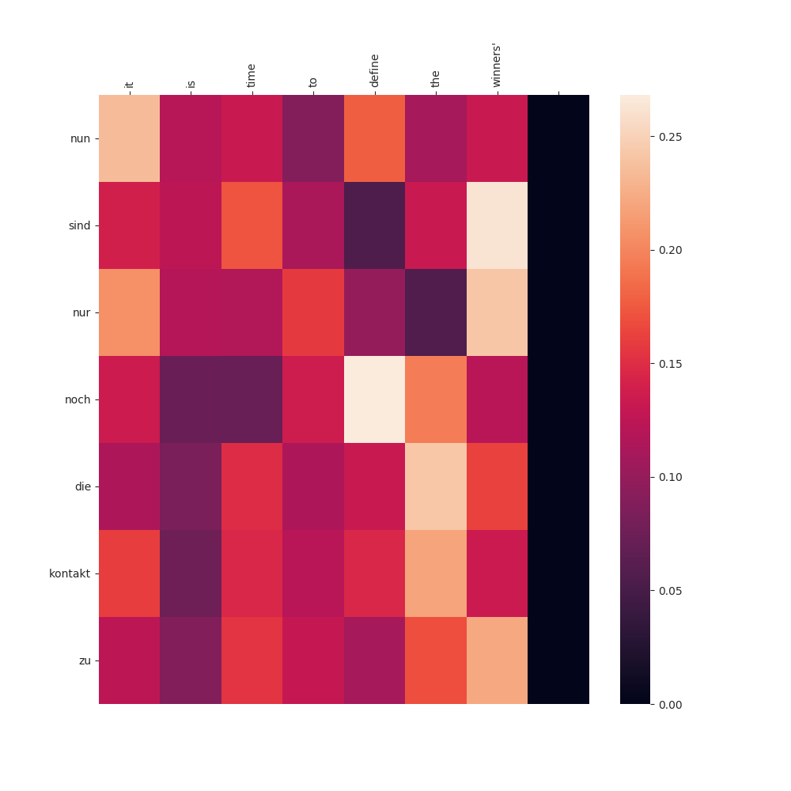

# Transformer

Simple Implementation of Transformer which appeared in '[Attention is all you need](https://arxiv.org/abs/1706.03762)'. 
To test the model
1. clone this repository
2. download required packages
3. run 'download.sh' scipt file to download datasets
4. run 'python transformer.py test'

### Sample Result Screenshot
* 
Dataset: [Stanford's Neural Machine Translation Project](https://nlp.stanford.edu/projects/nmt/). English to Deutsch(Germany)

* 
Sample Translation sentence

(I) = Input sentence   
(T) = Traget sentence   
(P) = Predict sentence  

* 
Sample Attention graph

